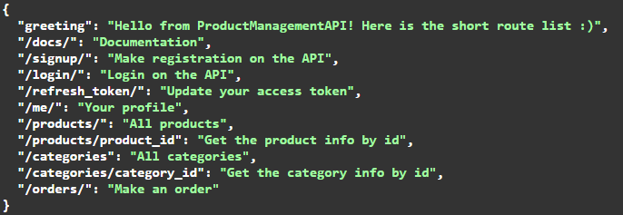

<div align="center">

# Product Management API
 
</div>


<hr>

## Table of Contents

- [About Project](#about-project)
- [Application functional](#functional)
- [Technologies](#technologies)
- [Prerequisites](#prerequisites)
- [Setup](#setup)
- [Accessing the Application](#accessing-the-application)
- [Shutdown](#shutdown)
- [Demo](#demo)


<hr>

## About Project

A Product Management API is a web-based application programming interface (API) 
that allows developers and businesses to manage various aspects of 
their products throughout their lifecycle. It typically provides a set of endpoints 
and functionality for creating, updating, retrieving, and deleting product information. 

<hr>

## Functional

1. Register a new user account 
2. Make authorization using JWT
4. CRUD for products and their categories
5. Buy products with payment by Stripe
6. Get order details on email and Telegram

<hr>

## Technologies

- [FastAPI Official Documentation](https://fastapi.tiangolo.com)
<br>`FastAPI` is a modern, fast (high-performance), web framework for building APIs with 
Python 3.7+ based on standard Python type hints. 
<br>This service builds the FastAPI application and exposes it on port 8000.


- [Stripe Official Documentation](https://stripe.com/docs)
<br>`Stripe` is a suite of APIs powering online payment processing and commerce solutions 
for internet businesses of all sizes. 
Accept payments and scale faster.
<br>In this project user can make payment by Stripe.


- [Telegram API Official Documentation](https://core.telegram.org/#getting-started)
<br>`Telegram API` allows you to build your own customized Telegram clients. It is 100% open for all developers who wish to create Telegram applications on our platform. 
<br>In this project, it is used to send users order details on Telegram.

<hr>


## Prerequisites

1. Make sure you have Docker and Docker Compose installed on your system. 
You can check the installation instructions [here for Docker](https://docs.docker.com/get-docker/) 
and [here for Docker Compose](https://docs.docker.com/compose/install/).


<hr>

## Setup

1. Clone the project:
```
https://github.com/diana-shyrokikh/product-management-system.git
```
2. Navigate to the project directory:
```
cd product-management-system
```
3. Сreate your .env file taking as an example .env.example file


4. Build and run the Docker containers:
```
docker-compose build
docker-compose up
```

You can use an admin account with that credentials:
``` 
login: admin
password: admin123456
```

For the test payment you can use that card information:
``` 
card number: 4242 4242 4242 4242
MM / YY: 12 / 25
CVC: 888
Cardholder name: Test
```

You can update the admin profile by adding your email and phone number 
for sending notifications on email and Telegram properly.

During making an order the first time you should write the phone number,
which will send messages on Telegram 

<hr>

## Accessing the Application

1. Product Management API is accessible at `http://localhost:8000/`.
2. The documentation is accessible at `http://localhost:8000/docs/`.

<hr>

## Shutdown

1. To stop running server use CTRL-BREAK

<hr>

## Demo




<hr>
Remember to replace `localhost` with the relevant 
IP address (127.0.0.1) if you're not accessing these from 
the same machine where the services are running.

